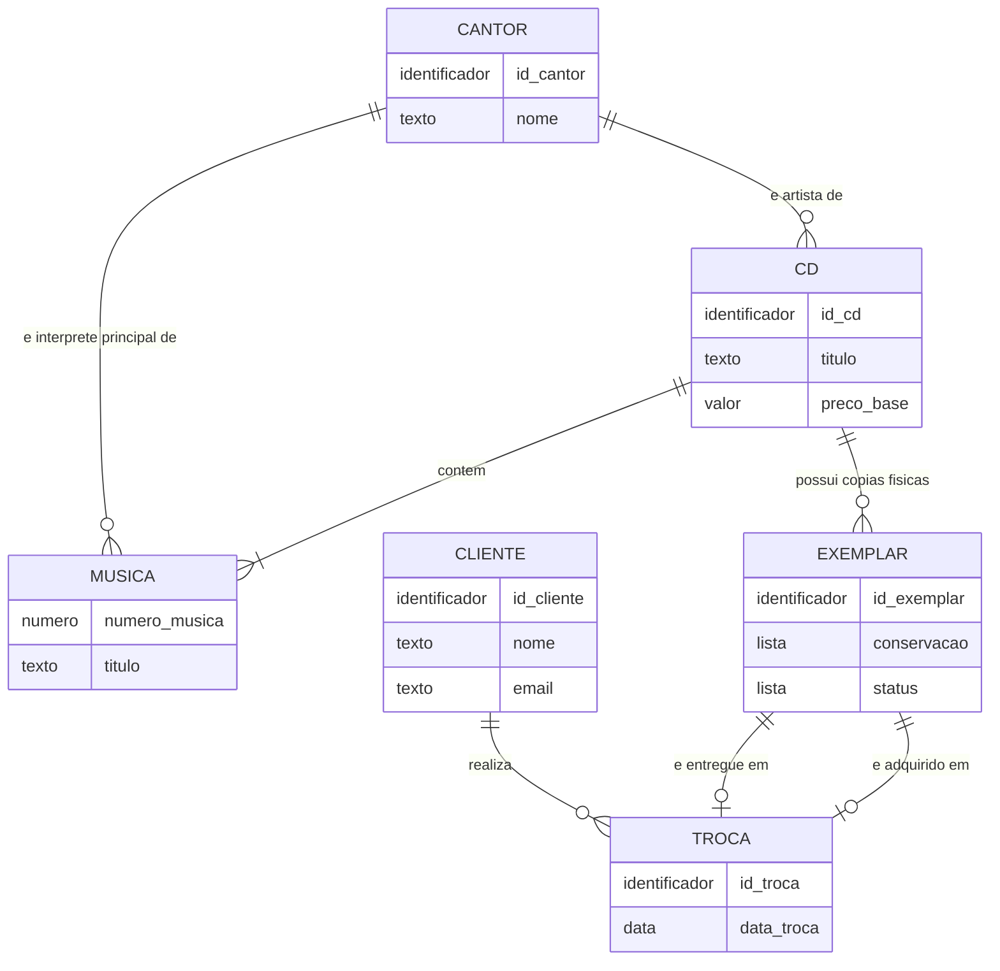

# Modelo Entidade-Relacionamento (MER)

Modelo **conceitual** do banco da *Ô, Meu! Troca Esse Disco*. Ele descreve entidades, atributos e relacionamentos, sem detalhes de implementação (tipos de dados e chaves estrangeiras ficam para o [DER](der.md)).

> As regras citadas (RN01, RN02...) estão em [regras-de-negocio.md](regras-de-negocio.md).

## 1. Diagrama

## 2. Entidades

| Entidade | Tipo | Descrição | Regras |
|----------|------|-----------|--------|
| **CANTOR** | Forte | Artista ou intérprete cadastrado. | RN03 |
| **CD** | Forte | Título do catálogo. Representa a *obra*, não a cópia física. | RN01 |
| **MUSICA** | **Fraca** | Faixa de um CD. Só existe dentro de um CD e é identificada por (CD + número da faixa). | RN02, RN04 |
| **CLIENTE** | Forte | Pessoa que realiza trocas. O e-mail é único. | RN09 |
| **EXEMPLAR** | Forte | Cópia física de um CD, com conservação e status. | RN05 a RN08 |
| **TROCA** | Forte | Operação em que um cliente entrega um exemplar e leva outro. | RN10 a RN13 |

## 3. Relacionamentos e cardinalidades

| Relacionamento | Cardinalidade | Leitura |
|----------------|---------------|---------|
| CANTOR **é artista de** CD | 1 : N | Um cantor tem vários CDs; cada CD tem um artista. |
| CANTOR **interpreta** MUSICA | 1 : N | Um cantor interpreta várias músicas; cada música tem **um** intérprete principal (RN03). |
| CD **contém** MUSICA | 1 : N (identificador) | Um CD tem uma ou mais músicas; cada música pertence a um único CD (RN02). |
| CD **possui** EXEMPLAR | 1 : N | Um CD pode ter vários exemplares; cada exemplar é de um único CD (RN05, RN06). |
| CLIENTE **realiza** TROCA | 1 : N | Um cliente pode fazer várias trocas; cada troca é de um cliente (RN10). |
| EXEMPLAR **é entregue em** TROCA | 1 : 0..1 | Cada troca tem exatamente um exemplar entregue; um exemplar é entregue em no máximo uma troca. |
| EXEMPLAR **é adquirido em** TROCA | 1 : 0..1 | Cada troca tem exatamente um exemplar adquirido; um exemplar é adquirido em no máximo uma troca. |

Os dois relacionamentos entre EXEMPLAR e TROCA são **papéis diferentes** da mesma entidade, e os exemplares de uma mesma troca devem ser distintos (RN11).

## 4. Atributos derivados

Não são armazenados. São calculados nas consultas.

| Atributo | Derivado de | Regra |
|----------|-------------|-------|
| `percentual_desconto` | `conservacao` do exemplar **entregue** | RN12 |
| `valor_final` | `preco_base` do CD do exemplar **adquirido** e do `percentual_desconto` | RN13 |

## 5. Justificativa das escolhas

1. **Separar CD e EXEMPLAR.** Um CD é um título e pode ter várias cópias físicas com estados diferentes. Sem a separação, título, artista e preço se repetiriam em cada cópia, gerando redundância e risco de inconsistência (RN01, RN05).
2. **MUSICA como entidade fraca.** A música não tem identidade fora do CD, então sua chave é composta por `(id_cd, numero_musica)`, como exige o enunciado (RN04).
3. **Intérprete na música, além do artista do CD.** Cada faixa tem seu intérprete principal (RN03), o que permite coletâneas e participações. Por isso há dois relacionamentos entre CANTOR e as entidades CD e MUSICA.
4. **TROCA como entidade, e não relacionamento N:N direto.** A troca tem identidade própria, data e vínculo com três entidades (cliente e dois exemplares), então é mais clara como entidade.
5. **Dois relacionamentos EXEMPLAR–TROCA.** Entregue e adquirido são papéis distintos com significados diferentes: um define o desconto e o outro define o preço-base.
6. **Desconto e valor final derivados.** Dependem de dados que já existem (conservação e preço-base). Guardá-los criaria dados que poderiam divergir dos originais.
7. **Conservação e status como domínios fechados.** Têm valores permitidos fixos (RN07, RN08), garantidos depois no DDL.

## 6. Pontos a confirmar com os scripts de carga

- Se `CD` realmente possui um artista (`id_cantor`) ou se isso só existe na `musica`.
- Os nomes e tipos exatos dos atributos além dos obrigatórios (preço-base, data da troca, ano etc.).
- Se existe algum atributo adicional nas tabelas fornecidas (gênero, país, telefone...).

O diagrama será ajustado se a carga indicar algo diferente.
